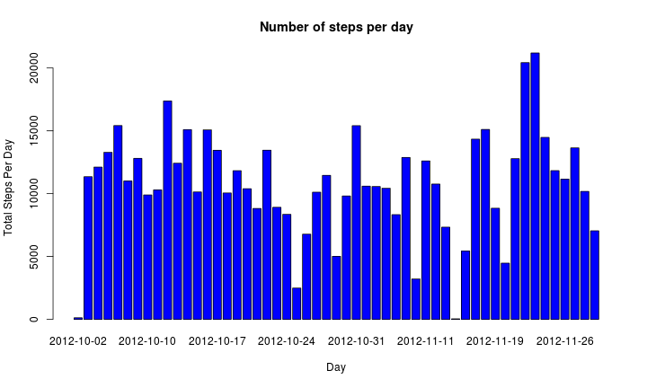

# Reproducible Research: Peer Assessment 1

Before starting the analysis set up all global options for the code chunks

```r
opts_chunk$set(fig.width = 10, fig.height = 6)
```


## Loading and preprocessing the data

```r
data <- read.csv("activity.csv")
```


## What is mean total number of steps taken per day?

**TODO: SHOULD BELOW BE BAR OR RATHER HISTOGRAM???** 
Group steps by date for which they were recorded:

```r
per_day <- aggregate(steps ~ date, data, sum)
#barplot
hist(
    per_day$steps, 
    main="Number of steps per day", 
    xlab="Day",
    ylab="Total Steps Per Day",
    #names.arg=per_day$date,
    col="blue",
    breaks=20
)
```

 


In order to understand total number of steps a little bit more one could 
calculate the mean and median of the series:

```r
mean_steps <- mean(per_day$steps)
median_steps <- median(per_day$steps)
```

Giving the following results:
- **Mean**: 1.0766 &times; 10<sup>4</sup>
- **Median**: 10765 

## What is the average daily activity pattern?


```r
per_interval <- aggregate(steps ~ interval, data, mean)
x <- per_interval$interval
y <- per_interval$steps
plot(x, y, type = "l", xlab = "Interval", ylab = "Average Steps", main = "Averaged Number of Steps per Interval")
```

 


One can clearly spot the maximum that appears at:

```r
subset(per_interval, steps == max(y))$interval
```

```
## [1] 835
```


## Imputing missing values


## Are there differences in activity patterns between weekdays and weekends?
